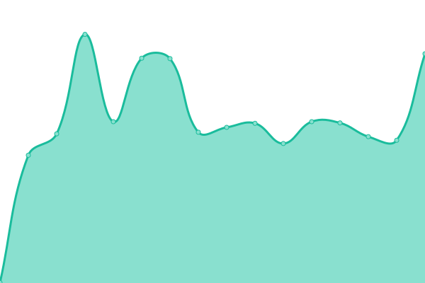

# [📈 Live Status](https://krakendeploy-com.github.io/kraken-status): <!--live status--> **🟩 All systems operational**

This repository contains the open-source uptime monitor and status page for [Kraken Deploy](https://krakendeploy-com.github.io/kraken-status), powered by [Upptime](https://github.com/upptime/upptime).

With [Upptime](https://upptime.js.org), you can get your own unlimited and free uptime monitor and status page, powered entirely by a GitHub repository. We use [Issues](https://github.com/krakendeploy-com/kraken-status/issues) as incident reports, [Actions](https://github.com/krakendeploy-com/kraken-status/actions) as uptime monitors, and [Pages](https://krakendeploy-com.github.io/kraken-status) for the status page.

<!--start: status pages-->
<!-- This summary is generated by Upptime (https://github.com/upptime/upptime) -->
<!-- Do not edit this manually, your changes will be overwritten -->
<!-- prettier-ignore -->
| URL | Status | History | Response Time | Uptime |
| --- | ------ | ------- | ------------- | ------ |
|  [Kraken Site](https://www.krakendeploy.com) | 🟩 Up | [kraken-site.yml](https://github.com/krakendeploy-com/kraken-status/commits/HEAD/history/kraken-site.yml) | 

 395ms
     
 | 

<a href="https://status.krakendeploy.com/history/kraken-site">100.00%</a>
    

|  [Kraken API](https://api.krakendeploy.com/health) | 🟩 Up | [kraken-api.yml](https://github.com/krakendeploy-com/kraken-status/commits/HEAD/history/kraken-api.yml) | 

 402ms
     
 | 

<a href="https://status.krakendeploy.com/history/kraken-api">100.00%</a>
    

|  [Kraken Agent API](https://agent-api.krakendeploy.com/health) | 🟩 Up | [kraken-agent-api.yml](https://github.com/krakendeploy-com/kraken-status/commits/HEAD/history/kraken-agent-api.yml) | 

 436ms
     
 | 

<a href="https://status.krakendeploy.com/history/kraken-agent-api">100.00%</a>
    

|  [Kraken Auth](https://auth.krakendeploy.com/health) | 🟩 Up | [kraken-auth.yml](https://github.com/krakendeploy-com/kraken-status/commits/HEAD/history/kraken-auth.yml) | 

 421ms
     
 | 

<a href="https://status.krakendeploy.com/history/kraken-auth">100.00%</a>
    

<!--end: status pages-->

[**Visit our status website →**](https://krakendeploy-com.github.io/kraken-status)

## 📄 License

- Powered by: [Upptime](https://github.com/upptime/upptime)
- Code: [MIT](./LICENSE) © [Anand Chowdhary](https://anandchowdhary.com), supported by [Pabio](https://pabio.com)
- Data in the `./history` directory: [Open Database License](https://opendatacommons.org/licenses/odbl/1-0/)
